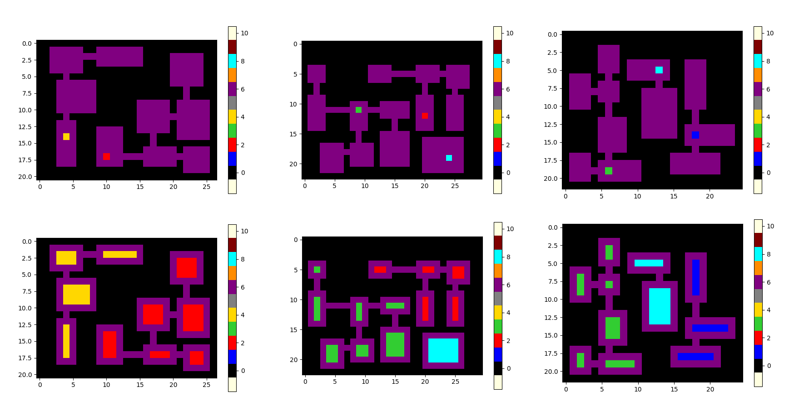
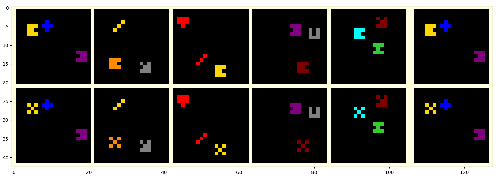
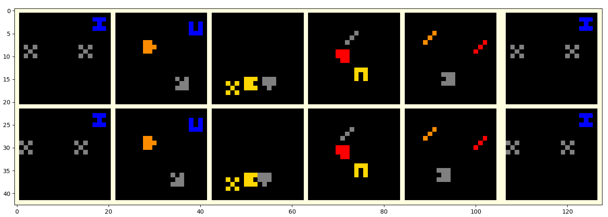

# ARC Generative DSL
Slowly building a collection of infinite riddle generators for benchmarking data-hungry methods. The riddles have been modified somewhat from the original in order to allow for randomization across features (such as range of colors, number of training boards, board sizes).  

## Notebooks
* gen_generic_dataset.ipynb - Generates 3 riddles at present (09c534e7, 007bbfb7, 27a28665).  

09c534e7

007bbfb7

27a28665

* gen_shape_scaling_and_rotation_riddles.ipynb - This notebook generates a variety of 18 different riddles that operate over several priors: shapes, scaling, coloring, cardinality and rotation, representation, repetition, in-filling.  Most riddles have a line in one of the corners.  The line may indicate things such as scale, padding, colors. A couple of examples are shown below.  Several of the riddles are fully described in the notebook, but some are not fully described (what they do can be deduced from the function name).

* gen_pixel_removal_color_change_and_combined_dataset.ipynb - This notebook generates 3 simple riddles that can be used in studying model performance.  One is a Pixel Removal.  The input boards have randomly colored pixels.  In one of the corners is a colored pixel.  The output board requires removing pixels of that color.  The second is Color Change.  The setup is the same as Pixel Removal.  In this case, two adjacent colors appear in one of the corners.  The one in the corner is the color to change.  The adjacent pixel is the color to change to.  The third is a Combined riddle.  This riddle combines both the Pixel Removal and Color Change riddles.  This generator was used in training transformers to show that the model learned the separate tasks (Pixel Removal and Color Change) from training on a dataset composed only of the Combined riddle.  It also learned the Combined riddle to some extent.  When training on the simple tasks, it did not generalize to the combined task (from training on a set of Pixel Removal and Color Change riddles).  The best model performance was achieved with a mix of all 3 riddles (performed better on all the riddle types). -- study by parapraxis

Example of Pixel Removal:

# Notebook Usage

The notebooks have a settings cell.  You don't need to change anything else if you just wish to generate data.  You'll need to set the dataset_folder, which is the output location.  The notebooks output .json files in the same format of the ARC Challenge.  You can set things such as the number of train boards (meta_trn_size).  There is a setting for the test set size, but ignore this (it hasn't been implemented).  There are generally settings for the grid size where you can use either a fixed board size or variable (fixed is easier for a model to learn, but may result in worse model generation to the real ARC tasks).  After you set the settings, you can run all the cells in the notebook.  You might get an error after the dataset is completed if the notebook runs some testing cells at the bottom of the notebook.  You can ignore this.  The cell that handles the generation, will also plot some of the items (of each type) in the output.  This is also a setting (plot_items).  

## Implemented Puzzles

### Dungeon Generation

https://github.com/arc-community/arc/wiki/Riddle_Evaluation_09c534e7

https://volotat.github.io/ARC-Game/?task=evaluation%2F09c534e7.json

Here we generate the dataset from puzzle "09c534e7" which looks a lot like a 2D rogue-like dungeon.
Here is the notebook for generating a dataset from the script: "gen_dungeon_dataset.ipynb"

### Sort-of-ARC Dataset

https://openreview.net/pdf?id=rCzfIruU5x5

We generate a dataset using this script in the notebook: "gen_sortOfARC_dataset.ipynb"

 
 
 
 

## TODO List

1. Group the helper functions (for reusability in a programming language style manner) - hence giving the name generative DSL.

2. Extend "sort of ARC" to more simultaneous rules and using different {board size, number of objects, size of objects, number of transformations}

3. More efficient rejection sampling for tensor dataset generation instead of iteration (let me know if this is urgent/ one of the functions is not fast enough)

4. Puzzle TODO list
- Easier next steps
  - 'A2FD1CF0' (https://volotat.github.io/ARC-Game/?task=training%2Fa2fd1cf0.json)
  - '137EAA0F' (https://volotat.github.io/ARC-Game/?task=training%2F137eaa0f.json) 
  - '321B1FC6' (https://volotat.github.io/ARC-Game/?task=training%2F321b1fc6.json)
  - '27F8CE4F' (https://volotat.github.io/ARC-Game/?task=evaluation%2F27f8ce4f.json)
- Parapraxis desired
  - '29700607' (https://volotat.github.io/ARC-Game/?task=evaluation%2F29700607.json)
  - '15663BA9' (https://volotat.github.io/ARC-Game/?task=evaluation%2F15663ba9.json)
  - '1ACC24AF' (https://volotat.github.io/ARC-Game/?task=evaluation%2F1acc24af.json)
- Not-so-easy 
  - '009D5C81' (Andreas already did?) (https://volotat.github.io/ARC-Game/?task=evaluation%2F009d5c81.json)
  - '150DEFF5' (https://volotat.github.io/ARC-Game/?task=training%2F150deff5.json)
  
  
  
  
  
  
  

  
